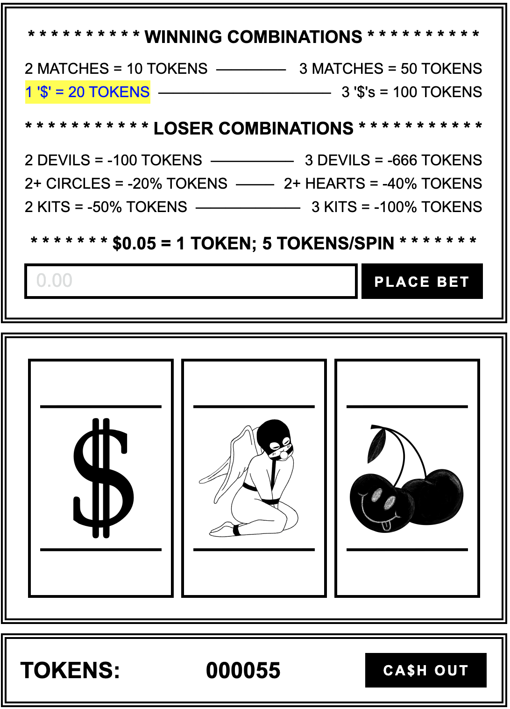

A casino favorite brought to you with a minimal aesthetic, online sex work subculture theme, and fun blackwork flash tattoo styled illustrations.

### TECHNOLOGIES USED 

HTML, CSS, Vanilla JavaScript, Procreate

### CURRENT FEATURES + HOW-TO'S

To minimize clutter of extra buttons or a score board: The spin function is activated when a player clicks anywhere within the spinner section. Like any other casino slot machine, the player may continue to play for as long as they like, by coughing up sufficient funds.

Along with the total score update in the bar beneath the spinner, the amount accumulated or lost during the current spin are rendered by playing sounds and highlighting the corresponding "WINNING" or "LOSING" combination text in a style reminiscent to token tip alerts recieved during live cam streams. In the spirit of the game's theme, certain combinations will perform correlating actions, one of which is site logos taking a percentage of the player's earnings. A comedic effect which also serves as commentary on content and service websites taking large cuts from both their performers and customers.

## <a href="https://h-b8.github.io/slot-machine/" target="_blank">FOR A GOOD TIME, CLICK TO PLAY!</a>

### ICE BOX FEATURES

- Responsive design for different browser window sizes, mobile, and tablet (As of now, the game is best viewed in a fullscreen browser)
- Add payment processor to create real slot machine experience
- Instead of resetting game, 'cash out' button will lead to a page where players can redeem their tokens for prizes
